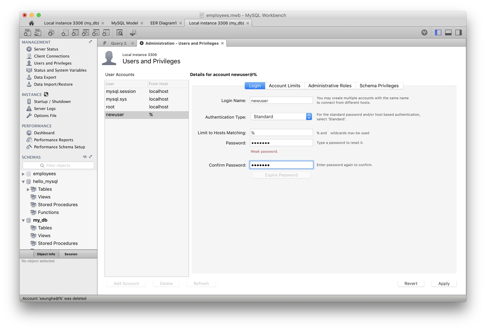
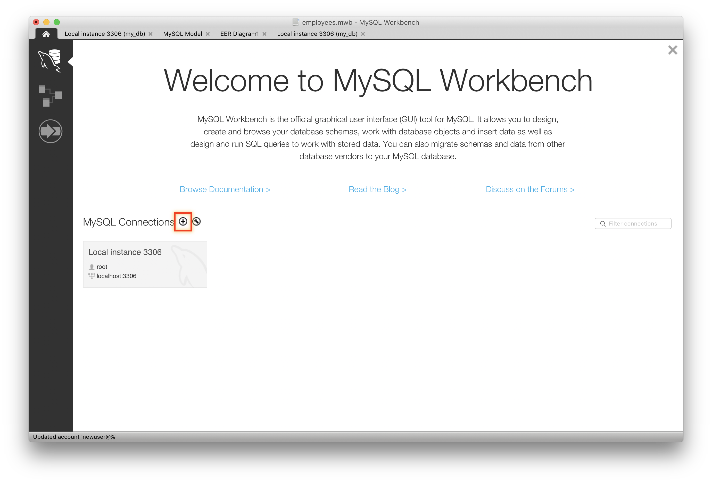
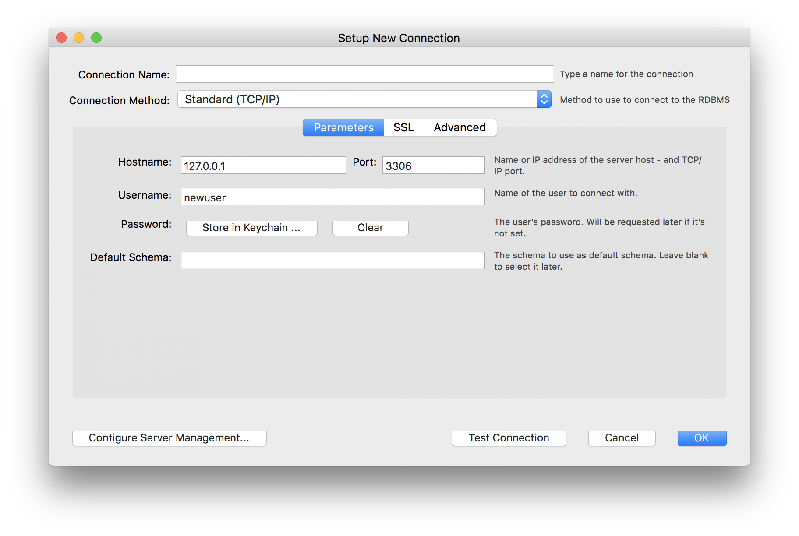

# 데이터베이스와 테이블

## 데이터베이스와 테이블의 생성

`CREATE DATABASE`는 데이터베이스를 만드는 명령어입니다. 워크벤치에서 root 계정으로 로그인한 후, 아래의 SQL을 실행해보세요.

```sql
-- 데이터베이스 생성
CREATE DATABASE my_db;

-- 모든 데이터베이스의 목록
SHOW DATABASES;
```

`CREATE TABLE`은 테이블을 만드는 명령입니다. 아래 명령을 차례로 실행해보세요.

```sql
-- 테이블 생성
CREATE TABLE my_db.users (
  -- `name`이라는 이름의 문자열 컬럼을 생성합니다. NULL을 허용하지 않습니다.
  name VARCHAR(30) NOT NULL,
  -- `job`이라는 이름의 문자열 컬럼을 생성합니다. NULL을 허용합니다.
  job VARCHAR(30),
  -- `age`라는 이름의 양수 컬럼을 생성합니다. NULL을 허용합니다.
  age INTEGER UNSIGNED,
  -- `name` 컬럼을 기본 키로 지정합니다.
  PRIMARY KEY (name)
);

-- my_db 데이터베이스에 있는 모든 테이블의 목록
SHOW TABLES FROM my_db;

-- my_db.users 테이블에 대한 자세한 정보
DESCRIBE my_db.users;
SHOW CREATE TABLE post;
```

`USE [database]`는 기본 데이터베이스를 설정하는 명령입니다. 즉, SQL을 작성할 때 데이터베이스 이름을 생략할 수 있게 만들어줍니다. 워크벤치에서는 사이드바의 데이터베이스 이름을 더블 클릭해도 같은 동작을 합니다. 기본 데이터베이스를 선택한 후 아래 명령을 실행해보세요.

```sql
DESCRIBE my_table;
```

# 사용자 생성과 권한 설정

### 사용자 생성



### 권한 설정


### 생성한 사용자로 로그인




# 데이터 추가하기

```sql
-- 하나의 레코드 추가하기
INSERT INTO users (name, job, age)
VALUES ('윤민지', '프론트엔드 개발자', 32);

-- 여러 개의 레코드 추가하기
INSERT INTO users (name, job, age)
VALUES ('한주원', '프론트엔드 개발자', 39),
('박현숙', '백엔드 개발자', 48),
('정병언', NULL, 25),
('임동면', '디자이너', NULL);
```

# 데이터 불러오기

```sql
-- 모든 컬럼을 포함시켜 불러오기
SELECT * FROM users;
```

```sql
-- 특정 컬럼만 포함시켜 불러오기
SELECT name, job FROM users;
```

# 데이터 수정하기

```sql
UPDATE users
SET job = '프로그래머'
WHERE name = '정병언';
```

# 데이터 삭제하기

```sql
DELETE FROM users
WHERE name = '정병언';
```

# 데이터베이스와 테이블의 삭제

`DROP DATABASE`, `DROP TABLE` 명령은 각각 데이터베이스와 테이블을 삭제하는 명령입니다. 아래의 명령을 차례대로 실행해보세요.

```sql
-- users 테이블 삭제
DROP TABLE users;

-- my_db 데이터베이스 삭제
DROP DATABASE my_db;
```