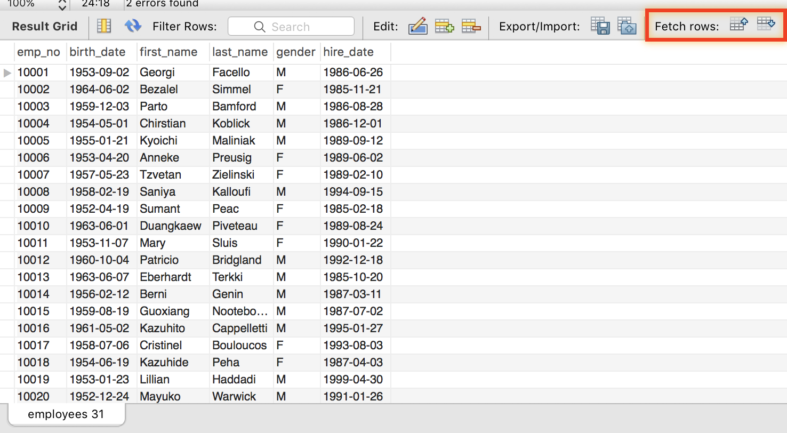
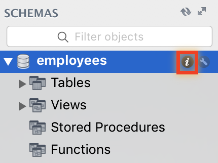

본 문서에서는 `SELECT` 구문을 사용해 데이터를 불러오는 방법을 설명합니다. `employees` 예제 데이터베이스를 이용합니다.

# 계정 만들기

실습하기에 앞서, `employees` 데이터베이스에만 접속할 수 있는 `emplyees_user` 계정을 만든 후 그 계정을 이용해 MySQL에 접속해봅시다.

# SELECT

가장 단순한 `SELECT` 구문을 실행해보겠습니다.

```sql
SELECT * FROM employees;
```

실행 후, 아래와 같이 결과가 나오면 성공입니다. `employees` 테이블에는 어떤 컬럼들이 있는지, 각 컬럼에는 어떤 형태의 데이터가 저장되고 있는지 파악해두도록 합시다.



MySQL Workbench는 레코드의 갯수가 많을 경우에 1000개 단위로 페이지를 끊어서 보여주는 기능을 가지고 있습니다. 이미지의 우측 상단에 빨갛게 표시된 버튼들을 눌러서 페이지를 이동할 수 있습니다.

이제 테이블의 일부 컬럼만 불러오는 구문을 실행해보겠습니다.

```sql
SELECT first_name FROM employees;
```

위 명령은 `employees` 테이블에서 `first_name` 컬럼만을 불러옵니다. 아래와 같이 여러 개의 컬럼을 선택적으로 불러올 수 있습니다.

```sql
SELECT first_name, last_name FROM employees;
```

또는 SQL 실행 결과로 출력되는 테이블의 컬럼의 이름을 바꾸어 출력할 수도 있습니다. 아래와 같이 각 컬럼의 이름 뒤에 `AS` 구문을 사용하면 됩니다. backtick(`) 문자를 사용해 컬럼의 이름에 MySQL 예약어나 공백 문자를 넣을 수 있습니다. (권장되지는 않습니다.)

```sql
SELECT first_name AS `family name`, last_name AS `given name` FROM employees;
```

`AS`를 생략하고 써도 같은 의미입니다.

```sql
SELECT first_name `family name`, last_name `given name` FROM employees;
```

# 정렬하기

`ORDER BY` 구문을 사용하면 특정 컬럼에 대한 정렬 기준을 세워 테이블을 출력할 수 있습니다. 아래와 같이 `hire_date` 컬럼을 기준으로 오름차순 정렬을 시킬 수 있습니다.

```sql
SELECT emp_no, hire_date, birth_date FROM employees
ORDER BY hire_date;
```

`ORDER BY` 구문에 포함된 컬럼이 꼭 `SELECT` 구문에 포함될 필요는 없습니다. 아래와 같이 `SELECT` 구문에서 `hire_date`를 생략해도 문제 없습니다.

```sql
SELECT emp_no FROM employees
ORDER BY hire_date;
```

`ORDER BY` 구문은 여러 개의 컬럼에 대해서 정렬하는 기능도 지원합니다. 아래와 같이 여러 개의 컬럼을 쉼표로 구분해서 `ORDER BY` 구문에 넣어 주면 됩니다. 이 때, `hire_date`로 먼저 오름차순 정렬 되고 난 후, 같은 `hire_date`를 가진 레코드끼리 `birth_date`를 기준으로 오름차순 정렬이 이루어집니다.

```sql
SELECT emp_no, hire_date, birth_date FROM employees
ORDER BY hire_date, birth_date;
```

`ORDER BY` 구문은 기본적으로 오름차순 정렬을 하게끔 되어 있습니다. 아래와 같이 `DESC` 구문을 사용하면 특정 컬럼에 대해서 내림차순 정렬을 하도록 명령할 수 있습니다. `DESC`와 `ASC`는 각각 'descending'과 'ascending'의 약자입니다.

```sql
SELECT first_name, hire_date, birth_date FROM employees
ORDER BY hire_date DESC, birth_date ASC; -- ASC는 생략 가능
```

## Character Set & Collation

MySQL은 날짜, 숫자 뿐 아니라 문자열에 대한 정렬도 지원합니다. 아래와 같이 이름을 이용해 정렬을 할 수도 있습니다.

```sql
SELECT first_name, last_name FROM employees
ORDER BY last_name, first_name;
```

MySQL은 다양한 언어와 문자셋을 지원합니다. 그런데 언어나 문자셋별로 문자열의 **정렬 기준**이 달라야 할 필요가 있습니다. 이러한 정렬 기준을 MySQL에서는 **collation**이라고 부릅니다.

한글의 경우, 문자셋은 `utf8`, collation은 `utf8mb4_general_ci`를 사용하면 됩니다.

MySQL 사용 중에 불러온 문자열이 깨져 보인다거나 정렬이 제대로 되지 않는다면, 문자셋과 collation의 설정이 잘못되었을 확률이 높습니다. 현재 데이터베이스의 기본 문자셋과 collation을 확인하려면, 아래와 같이 워크벤치 좌측 데이터베이스 목록의 'i' 모양 아이콘을 클릭하세요.



# 일부만 가져오기

`LIMIT` 구문을 사용하면 레코드의 일부분만 불러올 수 있습니다.

```sql
SELECT * FROM employees
LIMIT 5;
```

`LIMIT` 구문은 정렬 순서에 영향을 받습니다. 예를 들어, 생일이 가장 빠른 1명의 기록을 불러오고 싶다면 아래와 같이 하면 됩니다.

```sql
SELECT first_name, birth_date FROM employees
ORDER BY birth_date
LIMIT 1;
```

`OFFSET` 구문을 사용하면 앞쪽 기록의 일부분을 생략하고 나머지 기록들을 불러올 수 있습니다. 예를 들어, 생일이 열 번째로 빠른 1명의 기록을 불러오고 싶다면 아래와 같이 하면 됩니다.

```sql
SELECT first_name, birth_date FROM employees
ORDER BY birth_date
LIMIT 1 OFFSET 9;
```

# 중복되는 값 제거하기

`DISTINCT` 구문을 사용하면 컬럼 내에 중복되는 값을 하나로 합쳐서 보여줍니다. 아래 두 쿼리의 결과를 비교해보세요.

```sql
SELECT first_name FROM employees
ORDER BY first_name;
```

```sql
SELECT DISTINCT first_name FROM employees
ORDER BY first_name;
```

# 필터링과 연산자

`WHERE` 구문을 사용하면 특정 조건을 만족하는 기록만을 선택적으로 불러올 수 있습니다.

```sql
SELECT * FROM employees
WHERE first_name = 'Shahid' AND hire_date > '1997-09-12';
```

위와 같이 `WHERE` 구문에서는 조건을 나타내기 위해 연산자를 사용합니다. `WHERE` 구문 내에서 자주 사용되는 연산자와 그 뜻을 아래 표에서 확인할 수 있습니다.

| 연산자 | 뜻 |
| :--- | --- |
| A = B | A와 B가 같음 |
| A != B 또는 A <> B | A와 B가 같지 않음 |
| A < B | A가 B보다 작음 |
| A <= B | A가 B보다 작거나 같음 |
| A > B | A가 B보다 큼 |
| A >= B | A가 B보다 크거나 같음 |
| A IS NULL | A가 NULL임 |
| A IS NOT NULL | A가 NULL이 아님 |
| A LIKE '%PATTERN%' | A가 패턴과 일치함 |
| A REGEXP '/EXPRESSION/' | A가 정규표현식을 만족함 |
| A BETWEEN B AND C | A가 B와 C 사이에 있음 (B, C 포함) |
| A IN (B,C,D) | A가 B, C, D 중 하나와 일치함 |
| NOT A | A가 거짓 |
| A OR B | A 또는 B 둘 중 하나가 참 |
| A AND B | A와 B 모두 참 |

## 연산자 우선순위

여느 프로그래밍 언어가 그렇듯이 SQL에도 연산자 우선순위가 존재합니다. 예를 들어, `OR`보다 `AND`가 먼저 연산되기 때문에 아래와 같이 사용할 때는 주의해야 합니다.

```sql
-- first_name이 'Jeong' 혹은 'Shahid'인 사람들 중, 입사일이 '1997-09-12' 이후인 사람들을 불러오기 (틀림)
SELECT * FROM employees
WHERE first_name = 'Jeong' OR first_name = 'Shahid' AND hire_date > '1997-09-12';
-- 뒤쪽의 AND가 먼저 연산되어, 원래 의도와는 다르게 first_name이 'Jeong'인 모든 사람들이 포함된 결과가 나옵니다.
```

아래와 같이 괄호를 사용해서 특정 연산이 먼저 실행되도록 할 수 있습니다.

```sql
-- first_name이 'Jeong' 혹은 'Shahid'인 사람들 중, 입사일이 '1997-09-12' 이후인 사람들을 불러오기
SELECT * FROM employees
WHERE (first_name = 'Jeong' OR first_name = 'Shahid') AND hire_date > '1997-09-12';
```

연산자 우선순위의 전체 목록을 확인하려면 [공식 문서](https://dev.mysql.com/doc/refman/5.7/en/operator-precedence.html)를 참고하세요.

## DATE, DATETIME 리터럴

`DATE` 타입과 `DATETIME` 타입을 요구하는 문맥에서 아래와 같은 형태의 문자열을 사용하면, 자동으로 DATE와 DATETIME 형태로 해석됩니다.

```sql
'YYYY-MM-DD HH:MM:SS' -- DATETIME을 나타내는 문자열 형식
'YYYY-MM-DD' -- DATE를 나타내는 문자열 형식
```

문자열을 사용해서 아래와 같이 `hire_date`와 같은 `DATE` 형태의 컬럼에 대해 필터링을 할 수 있습니다.

```sql
SELECT * FROM employees
WHERE hire_date > '1997-09-12';
```

## NULL

`NULL` 값은 '데이터가 없음'을 나타내기 위한 목적으로 다루어지는 값입니다. 그런데 이 값은 연산 과정에서 특별하게 취급됩니다. 대부분의 연산자에 대해, 어떤 연산의 피연산자가 `NULL`이면 해당 연산의 결과는 무조건 `NULL`이 되게 됩니다.

```sql
1 > NULL -- 결과는 NULL이 됩니다.
1 = NULL -- 결과는 NULL이 됩니다.
NULL = NULL -- 심지어 이것도 NULL이 됩니다!
```

따라서, `NULL` 값을 허용하는 컬럼에 대해 연산을 할 때는 주의해야 합니다. 특히, 어떤 컬럼의 값이 `NULL`인지 아닌지 확인하기 위해서는 `=` 연산자 대신에 `IS` 혹은 `IS NOT` 연산자를 사용해야 합니다. 이를 테스트해보기 위해 `NULL` 값이 포함된 컬럼을 하나 추가합시다.

```sql
INSERT INTO titles (emp_no, title, from_date, to_date)
VALUES (10001, 'new title', '2017-09-11', NULL);
```

`TRUE` 혹은 `FALSE`를 써야하는 문맥에 `NULL`을 쓰면, `FALSE`로 취급됩니다. 아래 SQL 명령의 결과를 비교해보시기 바랍니다.

```sql
-- 이렇게 하면 안 됩니다!
SELECT * FROM titles
WHERE to_date = NULL; -- 무조건 FALSE로 취급됨
```

```sql
-- 반드시 이렇게 해야 합니다.
SELECT * FROM titles
WHERE to_date IS NULL;
```

```sql
-- 이렇게 하면 안 됩니다!
SELECT * FROM titles
WHERE to_date != NULL; -- 무조건 FALSE로 취급됨
```

```sql
-- 반드시 이렇게 해야 합니다.
SELECT * FROM titles
WHERE to_date IS NOT NULL;
```