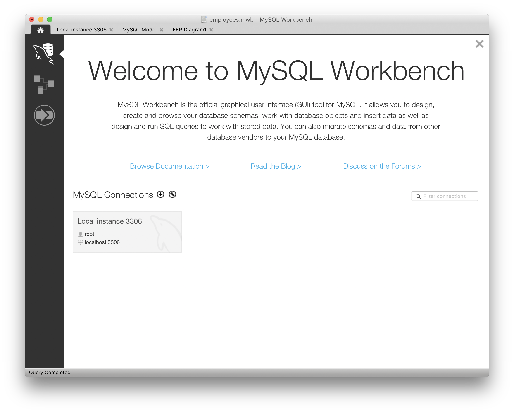
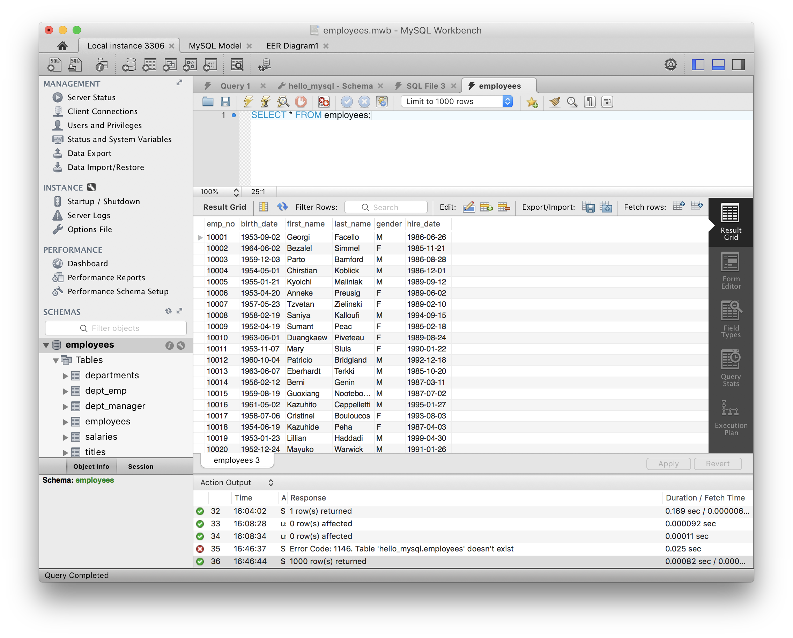

# 실습 환경 설치

## MySQL

  - 오픈소스 관계형 데이터베이스 중 가장 많이 사용됨
  - 다른 RDBMS에 비해 사용하기 쉽고 도구가 많음
  - 2009년 이후 오라클이 소유중이며, 무료 에디션과 상용 에디션이 있음

## MySQL 설치

### macOS

```
# macOS
$ brew install mysql
$ mysql-secure-installation
```

### Windows

[다운로드 링크](https://dev.mysql.com/downloads/windows/)

## 예제 데이터베이스 설치

[다운로드 링크](https://drive.google.com/open?id=0B7FmZRDPRZFvcDQ4eGtzSEt0UWs)

압축을 푼 뒤, 해당 폴더에서 아래 명령을 실행해주세요.

```mysql -uroot -p < employees.sql```

## MySQL Workbench 설치



## 데이터 불러오기


