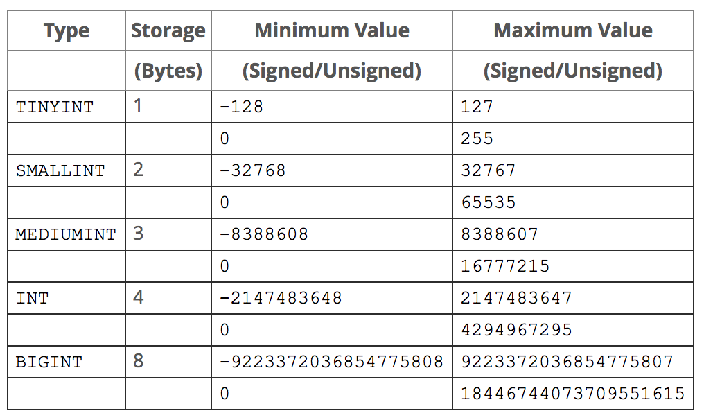

# 테이블 생성

테이블을 생성할 때는 `CREATE TABLE` 구문을 사용합니다.

```sql
CREATE TABLE my_table (
  -- 일반적인 컬럼은 아래와 같의 정의합니다. 이 컬럼에는 NULL 값이 저장될 수 있습니다.
  my_col1 INTEGER,

  -- 컬럼의 기본값을 지정합니다.
  my_col2 INTEGER DEFAULT 0,

  -- 컬럼에 NULL 값이 저장될 수 없도록 제한을 둡니다.
  my_col3 INTEGER NOT NULL,

  -- UNIQUE 제약조건: 컬럼의 값은 테이블 내에서 유일해야 합니다.
  my_col4 INTEGER UNIQUE,

  -- 다양한 옵션을 한 번에 지정할 수 있습니다.
  my_col5 INTEGER NOT NULL DEFAULT 1,
  my_col6 INTEGER NOT NULL UNIQUE,

  -- 1부터 시작하는 식별자를 아래와 같이 정의합니다.
  -- PRIMARY KEY는 기본적으로 NOT NULL, UNIQUE 규칙이 적용됩니다.
  my_id INTEGER UNSIGNED AUTO_INCREMENT PRIMARY KEY,

  -- 컬럼 정의와 별도로, 여러가지 제약 조건과 인덱스를 아래에 지정할 수 있습니다.
  -- 제약 조건과 인덱스에 대해서는 추후 배울 것입니다.
  FOREIGN KEY (my_id) REFERENCES your_table(your_id) ON DELETE CASCADE,
  INDEX my_idx (my_col1, my_col2),
  ...
)
```

테이블이 이미 존재하는 경우에도 구문이 에러 없이 실행되도록 `IF NOT EXISTS` 구문을 사용할 수 있습니다.

```sql
CREATE TABLE IF NOT EXISTS table_name (
  ...
)
```

# 테이블 수정

```sql
ALTER TABLE table_name
RENAME new_table_name, -- 테이블 이름 변경
ADD COLUMN column_name INTEGER NOT NULL, -- 컬럼 추가
ADD CONSTRAINT UNIQUE, -- 제약 조건 추가
CHANGE old_column_name new_column_name INTEGER, -- 컬럼 이름 변경
MODIFY column_name NEW_TYPE -- 컬럼 타입 변경
DROP COLUMN column_name; -- 컬럼 제거
```

자세한 사용법은 [공식 문서](https://dev.mysql.com/doc/refman/5.7/en/alter-table.html)를 참고해주세요.

# MySQL 데이터 타입

## 문자열

### VARCHAR

짧은 문자열을 저장하기 위해 가장 널리 사용되는 타입입니다. 컬럼 타입으로 지정할 때는 아래와 같이 문자열의 길이(바이트)를 명시해야 합니다.

```sql
VARCHAR(255) -- 255는 가장 널리 사용되는 길이입니다.
```

### TEXT

긴 문자열을 저장하기 위해 사용되는 타입입니다. `TEXT` 타입의 컬럼에는 64MB까지 저장할 수 있습니다. 요구사항에 따라 크기가 다른 다양한 종류의 `TEXT` 타입(TINYTEXT, TEXT, MEDIUMTEXT, LONGTEXT)을 사용할 수 있습니다.

---

## 수

정수, 고정 소수점, 부동 소수점을 위한 타입이 있습니다. 모든 수 타입은 양수만을 저장하기 위해 타입 뒤에 UNSIGNED 지시자를 사용할 수 있습니다.

### INTEGER

정수를 위한 타입입니다. `INT`로 줄여 쓸 수도 있습니다. 요구사항에 따라 크기가 다른 다양한 종류의 `INT` 타입(TINYINT, SMALLINT, MEDIUMINT, INT, BIGINT)을 사용할 수 있습니다.



```sql
INTEGER UNSIGNED -- INTEGER 타입의 양수를 저장할 수 있습니다.
```

MySQL에는 참, 거짓을 나타내는 boolean 관련 타입이 없습니다. 대신 TINYINT를 사용합니다.

### DECIMAL

고정 소수점 수를 위한 타입입니다. 십진수의 정확한 계산이 필요할 때 사용합니다. 정수부(최대 65), 소수부(최대 30, 정수부보다 짧거나 같아야 함)의 최대 길이를 각각 지정할 수 있습니다.

```sql
DECIMAL(5, 2) -- 12345.67과 같은 수를 저장할 수 있습니다.
```

### DOUBLE

부동 소수점 수를 위한 타입입니다. 소수의 빠른 계산과 효율적 저장이 필요할 때 사용합니다.

---

## 시각

MySQL에는 시각의 저장을 위한 타입들이 준비되어 있습니다. 주로 사용되는 아래의 두 타입은 **시간대 정보**를 저장하지 않기 때문에, 사용에 주의를 요합니다.

### DATE

`DATE` 타입은 날짜를 위한 타입입니다.

### DATETIME

`DATETIME` 타입은 날짜와 시각을 같이 저장해야 할 때 사용합니다.

## 기타

- `ENUM`: 열거형을 위한 타입입니다.
- `JSON`: MySQL 5.7에 JSON 지원이 추가되었으나, 널리 사용되지는 않습니다.
- `POINT`, `GEOMETRY` : 공간 정보를 위한 타입입니다.